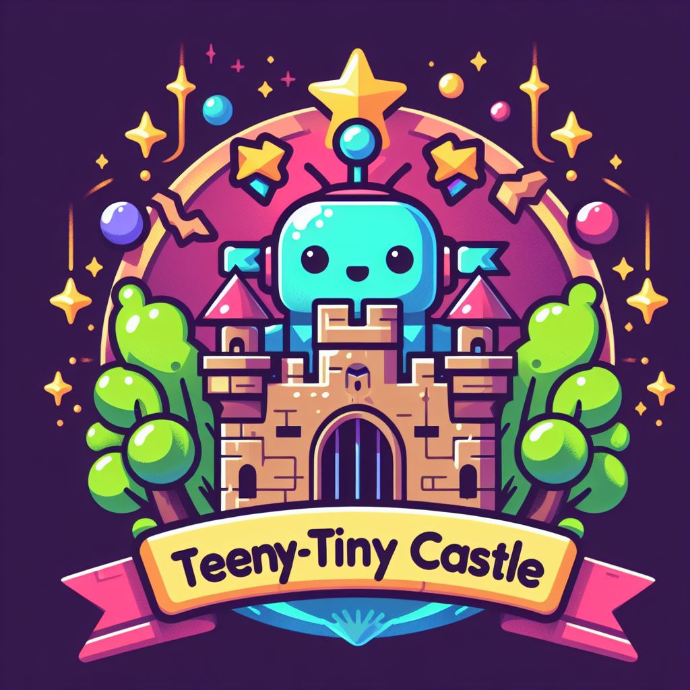

# Teeny-Tiny Castle 🏰

[](https://doi.org/10.5281/zenodo.7485126)



AI Ethics and Safety are (_relatively_) new fields, and their tools (and how to handle them) are still _not known to most of the development community_. To address this problem, we created the **Teeny-Tiny Castle**, an open-source repository containing "_Educational tools for AI Ethics and Safety Research_." There, the developer can find many examples of how to use programming tools to deal with various problems raised in the literature (e.g., algorithmic discrimination, model opacity, etc.).

At the moment, our repository has several examples of how to work ethically and safely with AI. Our lines of focus are on issues related to **Accountability & Sustainability**, **Interpretability**, **Robustness/Adversarial**, and **Fairness**, all being worked through examples that refer to some of the most common contemporary AI applications (e.g., _Computer Vision, Natural language Processing, Classification & Forecasting_, etc.). You can also find an _introductory course on ML_ in the [ML Intro Course](https://github.com/Nkluge-correa/teeny-tiny_castle/tree/master/ML%20Intro%20Course) folder.

To run the notebooks just open them in your Google Drive as a **Colab Notebook**, or you can also follow our [Python and VS Code installation tutorial](https://github.com/Nkluge-correa/teeny-tiny_castle/blob/master/ML%20Intro%20Course/1_python_VS_code_installation.md) if you want to run these notebooks on your own workstation. All requirements are specified in the [requirements.txt](requirements.txt) file. All notebooks were written using Python 3.9.13.

## AI Ethics ⚖️

In pursuing responsible and ethical AI development, staying informed about the principles, risks, regulations, and challenges associated with artificial intelligence is essential. Explore the following resources to deepen your understanding of AI ethics.

| Supporting resources                                                | URL                                                                                     |
|---------------------------------------------------------------------|-----------------------------------------------------------------------------------------|
| Learn about AI principles in the WAIE dashboard                     | <a href="https://nkluge-correa.github.io/worldwide_AI-ethics/" target="_blank">LINK</a> |
| Learn about the risks related to AI models                          | <a href="https://playground.airespucrs.org/model-library" target="_blank">LINK</a>      |
| Get informed about AI regulation in Brazil                          | <a href="https://www.airespucrs.org/en/nota-tecnica-aires" target="_blank">LINK</a>     |
| Learn about the problems related to facial recognition technologies | <a href="https://www.airespucrs.org/en/nota-tecnica-frt" target="_blank">LINK</a>       |

## Machine Learning Introduction Course 📈

Whether you're a beginner or looking to refresh your skills, this course covers a range of essential topics in machine learning. From setting up your own workstation with Visual Studio Code to deploying a forecasting model as an API with FastAPI, each tutorial provides hands-on experience and practical knowledge.

| Tutorial                                                                 | URL                                                                                                                                                                                   | Colab                                                                                                                                                                                            |
|--------------------------------------------------------------------------|---------------------------------------------------------------------------------------------------------------------------------------------------------------------------------------|--------------------------------------------------------------------------------------------------------------------------------------------------------------------------------------------------|
| Build your own workstation with Visual Studio Code                       | <a href="https://github.com/Nkluge-correa/teeny-tiny_castle/blob/master/ML%20Intro%20Course/1_python_VS_code_installation.md" target="_blank">LINK</a>                                | ❌                                                                                                                                                                                                |
| Introduction to Python                                                   | <a href="https://github.com/Nkluge-correa/teeny-tiny_castle/blob/master/ML%20Intro%20Course/2_Basic_Python_Tutorial.ipynb" target="_blank">LINK</a>                                   | <a href="https://colab.research.google.com/drive/1JEq9HFx2JuESFOx2ZrczCSahkEuvsJiF" target="_blank"></a> |
| Basic `Pandas`, `Scikit-learn`, and `Numpy` tutorial                     | <a href="https://github.com/Nkluge-correa/teeny-tiny_castle/blob/master/ML%20Intro%20Course/3_Basic_Pandas_Scikit_learn_NumPy_Tutorial.ipynb" target="_blank">LINK</a>                | <a href="https://colab.research.google.com/drive/1iBNPwys7dcAuY0A1Y9NhK-B--MWUhN4l" target="_blank"></a> |
| Gradient Descent from scratch                                            | <a href="https://github.com/Nkluge-correa/teeny-tiny_castle/blob/master/ML%20Intro%20Course/4_gradient_descent.ipynb" target="_blank">LINK</a>                                        | <a href="https://colab.research.google.com/drive/16uI06pVydcNPaM5klId7r97FCtXscKMf" target="_blank"></a> |
| Linear Regression with gradient descent from scratch                     | <a href="https://github.com/Nkluge-correa/teeny-tiny_castle/blob/master/ML%20Intro%20Course/5_linear_regression_numpy.ipynb" target="_blank">LINK</a>                                 | <a href="https://colab.research.google.com/drive/1U8KVjx-XrVy-O8Ryx2YfjSkdsTwtuZQw" target="_blank"></a> |
| Multi-Layer Perceptron with `NumPy`                                      | <a href="https://github.com/Nkluge-correa/teeny-tiny_castle/blob/master/ML%20Intro%20Course/6_xor_problem.ipynb" target="_blank">LINK</a>                                             | <a href="https://colab.research.google.com/drive/1S3FJKD5TuZNVQ5m09sVEJpRdb-2_1KEr" target="_blank"></a> |
| Feed-Forward Neural Network from scratch with `NumPy`                    | <a href="https://github.com/Nkluge-correa/teeny-tiny_castle/blob/master/ML%20Intro%20Course/7_MNIST_numpy.ipynb" target="_blank">LINK</a>                                             | <a href="https://colab.research.google.com/drive/16uJKD5AO3ZWzZSAj3I14lLyPMnEkvZFV" target="_blank"></a> |
| Introduction to `Keras` and `TensorFlow` using the Fashion-MNIST dataset | <a href="https://github.com/Nkluge-correa/teeny-tiny_castle/blob/master/ML%20Intro%20Course/8_Fashion_MNIST.ipynb" target="_blank">LINK</a>                                           | <a href="https://colab.research.google.com/drive/1qEwL994u80q8cB02JybkxIT_fg22b0KW" target="_blank"></a> |
| Introduction to `PyTorch` using the Digit-MNIST dataset                  | <a href="https://github.com/Nkluge-correa/teeny-tiny_castle/blob/master/ML%20Intro%20Course/9_MNIST_torch.ipynb" target="_blank">LINK</a>                                             | <a href="https://colab.research.google.com/drive/1wR5WnJFE9mGov_-yPkLagGXTR41VAGu5" target="_blank"></a> |
| Hyperparameter optimization with `KerasTuner`                            | <a href="https://github.com/Nkluge-correa/teeny-tiny_castle/blob/master/ML%20Intro%20Course/10_hyperparameter_tuning.ipynb" target="_blank">LINK</a>                                  | <a href="https://colab.research.google.com/drive/1moOGHGc48OAHJIPCbhuIjGpJCwxrSr7v" target="_blank"></a> |
| Dataset processing with `TFDS`                                           | <a href="https://github.com/Nkluge-correa/teeny-tiny_castle/blob/master/ML%20Intro%20Course/11_using_tfds.ipynb" target="_blank">LINK</a>                                             | <a href="https://colab.research.google.com/drive/1c0Z0aaiYa8aaJu___k3zhnF8aT1EwokF" target="_blank"></a> |
| Experimentation tracking with `Tensorboard`                              | <a href="https://github.com/Nkluge-correa/teeny-tiny_castle/blob/master/ML%20Intro%20Course/12_tensorboard_visualization.ipynb" target="_blank">LINK</a>                              | <a href="https://colab.research.google.com/drive/10V6D9l8BOB6xPq9ByWJik87iZOQsTdFf" target="_blank"></a> |
| Introduction to recommendation systems                                   | <a href="https://github.com/Nkluge-correa/teeny-tiny_castle/blob/master/ML%20Intro%20Course/13_recommender_systems.ipynb" target="_blank">LINK</a>                                    | <a href="https://colab.research.google.com/drive/1-5A3AYPS6Yl7JrVeVTPR4ovOphJL-fHC" target="_blank"></a> |
| Introduction to time series forecasting and `XGBoost`                    | <a href="https://github.com/Nkluge-correa/teeny-tiny_castle/blob/master/ML%20Intro%20Course/14_time_series_forecasting.ipynb" target="_blank">LINK</a>                                | <a href="https://colab.research.google.com/drive/1djcRz-WZtsEtRtvBNvdhRQYBQ6xPytWw" target="_blank"></a> |
| Text classification with Transformers                                    | <a href="https://github.com/Nkluge-correa/teeny-tiny_castle/blob/master/ML%20Intro%20Course/15_toxicity_detection.ipynb" target="_blank">LINK</a>                                     | <a href="https://colab.research.google.com/drive/1ylzigj4yN0qNQjVVuVHzsrOkrq1FpDBy" target="_blank"></a> |
| Sequence-to-sequence modeling with RNNs and Transformers                 | <a href="https://github.com/Nkluge-correa/teeny-tiny_castle/blob/48d415094d30e0e5bc8dde32715bb57428a87d7d/ML%20Intro%20Course/16_sequence_to_sequence.ipynb" target="_blank">LINK</a> | <a href="https://colab.research.google.com/drive/1eg8wxp-rNu_be1fDRUjsHQZ54LIGHd9i" target="_blank"></a> |
| Text-generation with the GPT architecture                                | <a href="https://github.com/Nkluge-correa/teeny-tiny_castle/blob/master/ML%20Intro%20Course/17_text_generation.ipynb" target="_blank">LINK</a>                                        | <a href="https://colab.research.google.com/drive/1eriKZDafxRPYj42xV53-jhs-2YfbQzwh" target="_blank"></a> |
| Introduction to Reinforcement Learning                                   | <a href="https://github.com/Nkluge-correa/teeny-tiny_castle/blob/master/ML%20Intro%20Course/18_Q_learning.ipynb" target="_blank">LINK</a>                                             | <a href="https://colab.research.google.com/drive/1lledEJ2rc3SD39St7NnsM_vGmj4R-qrh" target="_blank"></a> |
| Creating ML apps with `Gradio`                                           | <a href="https://github.com/Nkluge-correa/teeny-tiny_castle/blob/master/ML%20Intro%20Course/19_quick_AI_app.ipynb" target="_blank">LINK</a>                                           | <a href="https://colab.research.google.com/drive/1rghHhR4TShqkYk4qbZvg0N5oAku2USon" target="_blank"></a> |
| Deploying a forcasting model as an API with `FastAPI`                    | <a href="https://github.com/Nkluge-correa/teeny-tiny_castle/blob/master/ML%20Intro%20Course/20_ML_api_deployment.ipynb" target="_blank">LINK</a>                                      | <a href="https://colab.research.google.com/drive/1n5VqXUgwqPJaH7IRQltFaOl68-WYS7gU" target="_blank"></a> |

## Accountability & Sutentability ♻️

Learn how to generate model cards for transparent model reporting, explore the environmental impact of your models with CO2 emission reports using CodeCarbon, and navigate the accuracy versus sustainability dilemma.

| Tutorial                                   | URL                                                                                                                                                                    | Colab                                                                                                                                                                                            |
|--------------------------------------------|------------------------------------------------------------------------------------------------------------------------------------------------------------------------|--------------------------------------------------------------------------------------------------------------------------------------------------------------------------------------------------|
| Model cards for model reporting            | <a href="https://github.com/Nkluge-correa/teeny-tiny_castle/blob/master/ML%20Accountability/Model%20Cards/model_card_generator.ipynb" target="_blank">LINK</a>         | <a href="https://colab.research.google.com/drive/1mnz-AbRYQua1bByOwxZwsFpySrJS6GJl" target="_blank"></a> |
| CO2 emission reports with `CodeCarbon`     | <a href="https://github.com/Nkluge-correa/teeny-tiny_castle/blob/master/ML%20Accountability/CO2%20Emission%20Report/emission_tracker.ipynb" target="_blank">LINK</a>   | ❌                                                                                                                                                                                                |
| The accuracy versus sustainability dilemma | <a href="https://github.com/Nkluge-correa/teeny-tiny_castle/blob/master/ML%20Accountability/CO2%20Emission%20Report/carbon_emission_cv.ipynb" target="_blank">LINK</a> | ❌                                                                                                                                                                                                |

## Interpretability with CV 🖼️

Understanding and interpreting the decisions made by machine learning models is essential for building trust and making informed decisions. In this course, we explore various techniques for interpretability in computer vision. From introducing convolutional neural networks with CIFAR-10 to exploring feature visualization, maximum activation manipulation, saliency mapping, and using LIME for interpretation, each tutorial provides insights into the inner workings of CV models.

| Tutorial                                                 | URL                                                                                                                                                                         | Colab |
|----------------------------------------------------------|-----------------------------------------------------------------------------------------------------------------------------------------------------------------------------|-------|
| Introduction to CNNs with `CIFAR-10`                     | <a href="https://github.com/Nkluge-correa/teeny-tiny_castle/blob/master/ML%20Explainability/CV%20Interpreter/CNN_model_maker.ipynb" target="_blank">LINK</a>                | ❌     |
| Introduction to feature visualization                    | <a href="https://github.com/Nkluge-correa/teeny-tiny_castle/blob/master/ML%20Explainability/CV%20Interpreter/CNN_feature_visualization.ipynb" target="_blank">LINK</a>      | ❌     |
| Introduction to maximum activation manipulation          | <a href="https://github.com/Nkluge-correa/teeny-tiny_castle/blob/master/ML%20Explainability/CV%20Interpreter/CNN_activation_maximization.ipynb" target="_blank">LINK</a>    | ❌     |
| Introduction to  saliency mapping                        | <a href="https://github.com/Nkluge-correa/teeny-tiny_castle/blob/master/ML%20Explainability/CV%20Interpreter/CNN_attribution_maps.ipynb" target="_blank">LINK</a>           | ❌     |
| Introduction to `LIME`                                   | <a href="https://github.com/Nkluge-correa/teeny-tiny_castle/blob/master/ML%20Explainability/CV%20Interpreter/CNN_attribution_maps_with_LIME.ipynb" target="_blank">LINK</a> | ❌     |
| Interpreting diffusion models with `diffusers-interpret` | <a href="https://github.com/Nkluge-correa/teeny-tiny_castle/blob/master/ML%20Explainability/CV%20Interpreter/diffusion_interpreter.ipynb" target="_blank">LINK</a>          | ❌     |

## Interpretability with NLP 📚

Unravel the complexities of natural language processing models and gain insights into their decision-making processes. From sentiment analysis and applying LIME explanations to LSTMs to exploring integrated gradients, interpreting BERT models, word2vector models, and embedding models, each tutorial provides a deep dive into NLP interpretability.

| Tutorial                                                 | URL                                                                                                                                                                                | Colab |
|----------------------------------------------------------|------------------------------------------------------------------------------------------------------------------------------------------------------------------------------------|-------|
| Introduction to sentiment analysis and NLP               | <a href="https://github.com/Nkluge-correa/teeny-tiny_castle/blob/master/ML%20Explainability/NLP%20Interpreter/model_maker.ipynb" target="_blank">LINK</a>                          | ❌     |
| Applying LIME explanations to LSTMs                      | <a href="https://github.com/Nkluge-correa/teeny-tiny_castle/blob/master/ML%20Explainability/NLP%20Interpreter/lime_for_NLP.ipynb" target="_blank">LINK</a>                         | ❌     |
| Introduction to integrated gradients                     | <a href="https://github.com/Nkluge-correa/teeny-tiny_castle/blob/master/ML%20Explainability/NLP%20Interpreter/integrated_gradients_in%20_keras_nlp.ipynb" target="_blank">LINK</a> | ❌     |
| Applying the integrated gradients method to BERT models  | <a href="https://github.com/Nkluge-correa/teeny-tiny_castle/blob/master/ML%20Explainability/NLP%20Interpreter/gradient_explanations_BERT.ipynb" target="_blank">LINK</a>           | ❌     |
| Interpreting word2vector models                          | <a href="https://github.com/Nkluge-correa/teeny-tiny_castle/blob/master/ML%20Explainability/NLP%20Interpreter/word2vec.ipynb" target="_blank">LINK</a>                             | ❌     |
| Interpreting embedding models                            | <a href="https://github.com/Nkluge-correa/teeny-tiny_castle/blob/master/ML%20Explainability/NLP%20Interpreter/investigating_word_embeddings.ipynb" target="_blank">LINK</a>        | ❌     |
| Exploring text corpora via text mining                   | <a href="https://github.com/Nkluge-correa/teeny-tiny_castle/blob/master/ML%20Explainability/NLP%20Interpreter/text_mining.ipynb" target="_blank">LINK</a>                          | ❌     |
| Dissecting the GPT-2 arquitecture with `TransformerLens` | <a href="https://github.com/Nkluge-correa/teeny-tiny_castle/blob/master/ML%20Explainability/NLP%20Interpreter/dissecting_gpt2.ipynb" target="_blank">LINK</a>                      | ❌     |

## Interpretability in Classification & Prediction with Tabular Data 📊

Gain a deeper understanding of classification and prediction models with tabular data through interpretability techniques. Explore how to apply explanation techniques to tabular classifiers, uncovering insights into their decision-making processes.
| Tutorial                                                              | URL                                                                                                                                                                       | Colab |
|-----------------------------------------------------------------------|---------------------------------------------------------------------------------------------------------------------------------------------------------------------------|-------|
| Applying LIME explanations to tabular classifiers                     | <a href="https://github.com/Nkluge-correa/teeny-tiny_castle/blob/master/ML%20Explainability/Tabular%20Interpreter/interpreter_for_tabular.ipynb" target="_blank">LINK</a> | ❌     |
| Exploring models trained on the COMPAS Recidivism Racial Bias dataset | <a href="https://github.com/Nkluge-correa/teeny-tiny_castle/blob/master/ML%20Explainability/Tabular%20Interpreter/fairness_xai_COMPAS.ipynb" target="_blank">LINK</a>     | ❌     |

## Machine Learning Fairness ⚖️

Advancing the discourse on machine learning fairness, the following tutorials delve into diverse facets of this crucial domain. From applying fairness metrics on datasets like Credit Card and Adult Census to enforcing fairness using tools like AIF360, these tutorials guide you through the intricate landscape of addressing biases in machine learning models.

| Tutorial                                             | URL                                                                                                                                                     | Colab                                                                                                                                                                                            |
|------------------------------------------------------|---------------------------------------------------------------------------------------------------------------------------------------------------------|--------------------------------------------------------------------------------------------------------------------------------------------------------------------------------------------------|
| Applying fairnes metrics on the Credit Cart Dataset  | <a href="https://github.com/Nkluge-correa/teeny-tiny_castle/blob/master/ML%20Fairness/fair_metrics_Credit_card_approval.ipynb" target="_blank">LINK</a> | <a href="https://colab.research.google.com/drive/14F-XN4s95AgqDxrwdmB3Urk9vVQVi3GM" target="_blank"></a> |
| Applying fairnes metrics on the Adult Census Dataset | <a href="https://github.com/Nkluge-correa/teeny-tiny_castle/blob/master/ML%20Fairness/fairness_income.ipynb" target="_blank">LINK</a>                   | <a href="https://colab.research.google.com/drive/10BcFbOU2RsKVF-o1wz40K-JNfhADE043" target="_blank"></a> |
| Enforcing fairnes with `AIF360`                      | <a href="https://github.com/Nkluge-correa/teeny-tiny_castle/blob/master/ML%20Fairness/disparate_impact_remove_Hogwarts.ipynb" target="_blank">LINK</a>  | <a href="https://colab.research.google.com/drive/1xbVlJlEdJUbUIP2RWkvs4qyj23GT8ezl" target="_blank"></a> |
| Applying the principle of Ceteris paribus            | <a href="https://github.com/Nkluge-correa/teeny-tiny_castle/blob/master/ML%20Fairness/ceteris_paribus_profiles.ipynb" target="_blank">LINK</a>          | <a href="https://colab.research.google.com/drive/17u12_U3BuNBk5ySuT54AXloKCn1LPAHQ" target="_blank"></a> |
| Applying fairnes metrics on the `CelebA` dataset     | <a href="https://github.com/Nkluge-correa/teeny-tiny_castle/blob/master/ML%20Fairness/fair_metrics_celeba.ipynb" target="_blank">LINK</a>               | <a href="https://colab.research.google.com/drive/1Gvyb40OXeq0RPJA5WYVyr0S7bQWBGYe9" target="_blank"></a> |
| Investigating biases on text generation models       | <a href="https://github.com/Nkluge-correa/teeny-tiny_castle/blob/master/ML%20Fairness/nlp_fairness_distilgpt2.ipynb" target="_blank">LINK</a>           | <a href="https://colab.research.google.com/drive/1wHqVMRXgHZv5djFBV6w-QARL_cBn-tyF" target="_blank"></a> |

## Cybersecurity 👾

Explore the fusion of machine learning and cybersecurity as we demystify the process of classifying malware through deep neural networks and PE analysis.

| Tutorial                                                      | URL                                                                                                                                              | Colab |
|---------------------------------------------------------------|--------------------------------------------------------------------------------------------------------------------------------------------------|-------|
| Classifying malware with deep neural networks and PE analysis | <a href="https://github.com/Nkluge-correa/teeny-tiny_castle/blob/master/ML%20&%20Cybersecurity/Malware_detection.ipynb" target="_blank">LINK</a> | ❌    |

## Adversarial Machine Learning 🐱‍💻

Within these tutorials, we navigate the intricate landscape of thwarting adversarial attacks and understanding their nuances. Explore the dark arts of exploiting pickle serialization, create adversarial examples with SecML and Textattack, and apply the fast sign gradient method against convolutional neural networks.

| Tutorial                                            | URL                                                                                                                                               | Colab |
|-----------------------------------------------------|---------------------------------------------------------------------------------------------------------------------------------------------------|-------|
| Exploiting pickle serialization                     | <a href="https://github.com/Nkluge-correa/teeny-tiny_castle/blob/master/ML%20Adversarial/the_pickle_exploit.ipynb" target="_blank">LINK</a>       | ❌     |
| Creating adversarial examples with `SecML`          | <a href="https://github.com/Nkluge-correa/teeny-tiny_castle/blob/master/ML%20Adversarial/evasion_attacks.ipynb" target="_blank">LINK</a>          | ❌     |
| Applying the fast sign gradient method against CNNs | <a href="https://github.com/Nkluge-correa/teeny-tiny_castle/blob/master/ML%20Adversarial/evasion_attacks_FGSM.ipynb" target="_blank">LINK</a>     | ❌     |
| Creating adverarial examples with `textattack`      | <a href="https://github.com/Nkluge-correa/teeny-tiny_castle/blob/master/ML%20Adversarial/adversarial_text_attack.ipynb" target="_blank">LINK</a>  | ❌     |
| Extraction attacks via model clonning               | <a href="https://github.com/Nkluge-correa/teeny-tiny_castle/blob/master/ML%20Adversarial/model_extraction_nlp.ipynb" target="_blank">LINK</a>     | ❌     |
| Demonstrating poisoning attacks                     | <a href="https://github.com/Nkluge-correa/teeny-tiny_castle/blob/master/ML%20Adversarial/data_poisoning_attacks.ipynb" target="_blank">LINK</a>   | ❌     |
| Adversarial training for computer vision models     | <a href="https://github.com/Nkluge-correa/teeny-tiny_castle/blob/master/ML%20Adversarial/adversarial_training_cv.ipynb" target="_blank">LINK</a>  | ❌     |
| Adversarial training for language models            | <a href="https://github.com/Nkluge-correa/teeny-tiny_castle/blob/master/ML%20Adversarial/adversarial_training_nlp.ipynb" target="_blank">LINK</a> | ❌     |

## Cite as 🤗

```latex
@misc{teenytinycastle,
    doi = {10.5281/zenodo.7112065},
    url = {https://github.com/Nkluge-correa/teeny-tiny_castle},
    author = {Nicholas Kluge Corr{\^e}a},
    title = {Teeny-Tiny Castle},
    year = {2024},
    publisher = {GitHub},
    journal = {GitHub repository},
    note = {Last updated 12 January 2024},
}
```

---

This repository was built as part of the RAIES ([Rede de Inteligência Artificial Ética e Segura](https://www.raies.org/)) initiative, a project supported by FAPERGS - ([Fundação de Amparo à Pesquisa do Estado do Rio Grande do Sul](https://fapergs.rs.gov.br/inicial)), Brazil.
