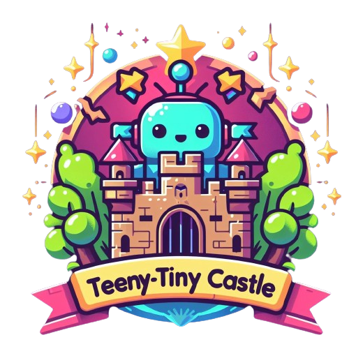

<div align="center">

# Teeny-Tiny Castle: educational tools for AI Ethics and Safety research

[](https://doi.org/10.5281/zenodo.7485126)



</div>

AI Ethics and Safety are (relatively) new fields, and their tools (and how to handle them) are still unknown to most of the development community. To address this problem, we created the **Teeny-Tiny Castle**, an open-source repository containing **"Educational tools for AI Ethics and Safety Research"**. Here, the developer can find many examples of how to deal with various problems raised in the literature (e.g., algorithmic discrimination, model opacity, etc.).

Our repository has several examples of how to work ethically and safely with AI, mainly focusing on issues related to **Accountability & Sustainability**, **Interpretability**, **Robustness/Adversarial**, and **Fairness**, all being worked through examples that refer to some of the most common contemporary AI applications (e.g., **Computer Vision**, **Natural language Processing**, **Classification & Forecasting**, etc.). In case you are new to the field, you will also find in the **Teeny-Tiny Castle** an [introductory course on ML](https://github.com/Nkluge-correa/TeenyTinyCastle/tree/master/ML-Intro-Course).

To run the notebooks, open them in your Google Drive as a **Colab Notebook**, or you can also follow our [Python and VS Code installation tutorial](https://github.com/Nkluge-correa/TeenyTinyCastle/blob/master/ML-Intro-Course/1_python_VS_code_installation.md) if you want to run these notebooks on your own workstation. All requirements are specified in the [requirements.txt](requirements.txt) file. All notebooks were written using Python 3.9.13.

> **Note: For more tools and metrics on the subject, we recommend the [OECD Tools & Metrics catalog](https://oecd.ai/en/catalogue/overview). This catalog also seeks to boost (in a much more extensive way) the popularity of tools and metrics to help AI actors build and deploy trustworthy AI systems.**

## AI Ethics ⚖️

In pursuing responsible and ethical AI development, staying informed about the principles, risks, regulations, and challenges associated with artificial intelligence is essential. Explore the following resources to deepen your understanding of AI ethics.

| Supporting resources                                                | URL                                                                                         |
|---------------------------------------------------------------------|---------------------------------------------------------------------------------------------|
| Learn about AI principles in the WAIE dashboard                     | <a href="https://nkluge-correa.github.io/worldwide_AI-ethics/" target="_blank">LINK</a>     |
| Learn about the risks related to AI models                          | <a href="https://nkluge-correa.github.io/Model-Library/" target="_blank">LINK</a>           |
| Get informed about AI regulation in Brazil                          | <a href="https://www.airespucrs.org/en/nota-tecnica-aires" target="_blank">LINK</a>         |
| Learn about the problems related to facial recognition technologies | <a href="https://www.airespucrs.org/en/nota-tecnica-frt" target="_blank">LINK</a>           |
| Learn about the EPS methodology for ethical and safe AI development | <a href="https://github.com/Nkluge-correa/ethical-problem-solving" target="_blank">LINK</a> |

## Machine Learning Introduction Course 📈

Whether you're a beginner or looking to refresh your skills, this course covers a range of essential topics in machine learning. From setting up your own workstation with Visual Studio Code to deploying a forecasting model as an API with FastAPI, each tutorial provides hands-on experience and practical knowledge.

| Tutorial                                                                 | GitHub                                                                                                                                                                                | Colab                                                                                                                                                                                            |
|--------------------------------------------------------------------------|---------------------------------------------------------------------------------------------------------------------------------------------------------------------------------------|--------------------------------------------------------------------------------------------------------------------------------------------------------------------------------------------------|
| Build your own workstation with Visual Studio Code                       | <a href="https://github.com/Nkluge-correa/TeenyTinyCastle/blob/master/ML-Intro-Course/1_python_VS_code_installation.md" target="_blank">LINK</a>                                | 👈                                                                                                                                                                                               |
| Introduction to Python                                                   | <a href="https://github.com/Nkluge-correa/TeenyTinyCastle/blob/master/ML-Intro-Course/2_Basic_Python_Tutorial.ipynb" target="_blank">LINK</a>                                   | <a href="https://colab.research.google.com/drive/1w0Dm3qsjarZhjPs02BIiyQsQQpsjM0KJ" target="_blank"></a> |
| Basic `Pandas`, `Scikit-learn`, and `Numpy` tutorial                     | <a href="https://github.com/Nkluge-correa/TeenyTinyCastle/blob/master/ML-Intro-Course/3_Basic_Pandas_Scikit_learn_NumPy_Tutorial.ipynb" target="_blank">LINK</a>                | <a href="https://colab.research.google.com/drive/1SNFTDQZJbBmJGEVxE8Ah3RMbfdJTXt4R" target="_blank"></a> |
| Gradient Descent from scratch                                            | <a href="https://github.com/Nkluge-correa/TeenyTinyCastle/blob/master/ML-Intro-Course/4_gradient_descent.ipynb" target="_blank">LINK</a>                                        | <a href="https://colab.research.google.com/drive/10zO6TJ5LNxRNVZ7aWeE-svbTIkQVnmL3" target="_blank"></a> |
| Linear Regression with gradient descent from scratch                     | <a href="https://github.com/Nkluge-correa/TeenyTinyCastle/blob/master/ML-Intro-Course/5_linear_regression_numpy.ipynb" target="_blank">LINK</a>                                 | <a href="https://colab.research.google.com/drive/1Cl15hxohNA-yCswQm9N69pcNiG6m4csh" target="_blank"></a> |
| Multi-Layer Perceptron with `NumPy`                                      | <a href="https://github.com/Nkluge-correa/TeenyTinyCastle/blob/master/ML-Intro-Course/6_xor_problem.ipynb" target="_blank">LINK</a>                                             | <a href="https://colab.research.google.com/drive/17NgS3-9l9xDYtCU_cwX3HnQs6YRPbJzb" target="_blank"></a> |
| Feed-Forward Neural Network from scratch with `NumPy`                    | <a href="https://github.com/Nkluge-correa/TeenyTinyCastle/blob/master/ML-Intro-Course/7_MNIST_numpy.ipynb" target="_blank">LINK</a>                                             | <a href="https://colab.research.google.com/drive/10ve3pt_04COK0RFYDfITPhXjN0BC9MDs" target="_blank"></a> |
| Introduction to `Keras` and `TensorFlow` using the Fashion-MNIST dataset | <a href="https://github.com/Nkluge-correa/TeenyTinyCastle/blob/master/ML-Intro-Course/8_Fashion_MNIST.ipynb" target="_blank">LINK</a>                                           | <a href="https://colab.research.google.com/drive/1ZSHGF7eOcipxXyoVnHkMKox2ErLxK6Qv" target="_blank"></a> |
| Introduction to `PyTorch` using the Digit-MNIST dataset                  | <a href="https://github.com/Nkluge-correa/TeenyTinyCastle/blob/master/ML-Intro-Course/9_MNIST_torch.ipynb" target="_blank">LINK</a>                                             | <a href="https://colab.research.google.com/drive/15kHGUWdtbxZMUENV5ffft658RBy-VQqb" target="_blank"></a> |
| Hyperparameter optimization with `KerasTuner`                            | <a href="https://github.com/Nkluge-correa/TeenyTinyCastle/blob/master/ML-Intro-Course/10_hyperparameter_tuning.ipynb" target="_blank">LINK</a>                                  | <a href="https://colab.research.google.com/drive/1POre5RlS0DmYBFGB-t6V-1Ldj0UeKRsy" target="_blank"></a> |
| Dataset processing with `TFDS`                                           | <a href="https://github.com/Nkluge-correa/TeenyTinyCastle/blob/master/ML-Intro-Course/11_using_tfds.ipynb" target="_blank">LINK</a>                                             | <a href="https://colab.research.google.com/drive/19NlP0nPNpp30o6ZVzRXyjMpvr3AXOui3" target="_blank"></a> |
| Experimentation tracking with `Tensorboard`                              | <a href="https://github.com/Nkluge-correa/TeenyTinyCastle/blob/master/ML-Intro-Course/12_tensorboard_visualization.ipynb" target="_blank">LINK</a>                              | <a href="https://colab.research.google.com/drive/1ddGvfXLBIO-L_82d5JHZEjG0HWLm4yR_" target="_blank"></a> |
| Introduction to recommendation systems                                   | <a href="https://github.com/Nkluge-correa/TeenyTinyCastle/blob/master/ML-Intro-Course/13_recommender_systems.ipynb" target="_blank">LINK</a>                                    | <a href="https://colab.research.google.com/drive/1wnSyOx61Z4oS3aYysyTbRva4VJjpsGoC" target="_blank"></a> |
| Introduction to time series forecasting and `XGBoost`                    | <a href="https://github.com/Nkluge-correa/TeenyTinyCastle/blob/master/ML-Intro-Course/14_time_series_forecasting.ipynb" target="_blank">LINK</a>                                | <a href="https://colab.research.google.com/drive/1afy9H9FgEdyYiLQo2-YWEpSrKbd60YAV" target="_blank"></a> |
| Text classification with Transformers                                    | <a href="https://github.com/Nkluge-correa/TeenyTinyCastle/blob/master/ML-Intro-Course/15_toxicity_detection.ipynb" target="_blank">LINK</a>                                     | <a href="https://colab.research.google.com/drive/1rmbBDZ3Cvju7cDq0KrHoTzrjPOrc6Bsc" target="_blank"></a> |
| Sequence-to-sequence modeling with RNNs and Transformers                 | <a href="https://github.com/Nkluge-correa/TeenyTinyCastle/blob/48d415094d30e0e5bc8dde32715bb57428a87d7d/ML-Intro-Course/16_sequence_to_sequence.ipynb" target="_blank">LINK</a> | <a href="https://colab.research.google.com/drive/1HGoo-rVPDJPmuaAoP1HEqO4qS5iyoaIr" target="_blank"></a> |
| Text-generation with the GPT architecture                                | <a href="https://github.com/Nkluge-correa/TeenyTinyCastle/blob/master/ML-Intro-Course/17_text_generation.ipynb" target="_blank">LINK</a>                                        | <a href="https://colab.research.google.com/drive/1YN6lkDLGiCD7Xdv0WYJ6al9WiSBWFwGC" target="_blank"></a> |
| Introduction to Reinforcement Learning                                   | <a href="https://github.com/Nkluge-correa/TeenyTinyCastle/blob/master/ML-Intro-Course/18_Q_learning.ipynb" target="_blank">LINK</a>                                             | <a href="https://colab.research.google.com/drive/1hd6PHpPEhGn0IPRuhF2GirWzwKliOYZo" target="_blank"></a> |
| Creating ML apps with `Gradio`                                           | <a href="https://github.com/Nkluge-correa/TeenyTinyCastle/blob/master/ML-Intro-Course/19_quick_AI_app.ipynb" target="_blank">LINK</a>                                           | <a href="https://colab.research.google.com/drive/14WTNyfVwsGYno5lUGKl3LMCcyzk9Cn-F" target="_blank"></a> |
| Deploying a forcasting model as an API with `FastAPI`                    | <a href="https://github.com/Nkluge-correa/TeenyTinyCastle/blob/master/ML-Intro-Course/20_ML_api_deployment.ipynb" target="_blank">LINK</a>                                      | <a href="https://colab.research.google.com/drive/1uu8TMTIFmDeoFzLtKRfKUIVTUut4X5ga" target="_blank"></a> |

## Accountability and Sustainability ♻️

Learn how to generate model cards for transparent model reporting, explore the environmental impact of your models with CO2 emission reports using CodeCarbon, and navigate the accuracy versus sustainability dilemma.

| Tutorial                                                                        | GitHub                                                                                                                                                           | Colab                                                                                                                                                                                            |
|---------------------------------------------------------------------------------|------------------------------------------------------------------------------------------------------------------------------------------------------------------|--------------------------------------------------------------------------------------------------------------------------------------------------------------------------------------------------|
| Accountability through Model Reporting                                          | <a href="https://github.com/Nkluge-correa/TeenyTinyCastle/blob/master/ML-Accountability/Model-Reporting/model_card_generator.ipynb" target="_blank">LINK</a>     | <a href="https://colab.research.google.com/drive/1uN-dX1tW8N-SGtWXSEhcNtmB7P-2aGVA" target="_blank"></a> |
| Tracking carbon emissions and power consumption with CodeCarbon                 | <a href="https://github.com/Nkluge-correa/TeenyTinyCastle/blob/master/ML-Accountability/CO2-Emission-tracking/emission_tracker.ipynb" target="_blank">LINK</a>   | <a href="https://colab.research.google.com/drive/1oZLM3uAHdqdbyVCq67CxHCzWK_ldqMEX" target="_blank"></a> |
| Architectural choices in computer vision and their impact on energy consumption | <a href="https://github.com/Nkluge-correa/TeenyTinyCastle/blob/master/ML-Accountability/CO2-Emission-tracking/carbon_emission_cv.ipynb" target="_blank">LINK</a> | <a href="https://colab.research.google.com/drive/1G3tP5kLD1MUjdVVOpg3vDWeqpI0Q03gh" target="_blank"></a> |

## Interpretability with CV 🖼️

Understanding and interpreting the decisions made by machine learning models is essential for building trust and making informed decisions. In this course, we explore various techniques for interpretability in computer vision. From introducing convolutional neural networks with CIFAR-10 to exploring feature visualization, maximum activation manipulation, saliency mapping, and using LIME for interpretation, each tutorial provides insights into the inner workings of CV models.

| Tutorial                                                 | GitHub                                                                                                                                                    | Colab                                                                                                                                                                                            |
|----------------------------------------------------------|-----------------------------------------------------------------------------------------------------------------------------------------------------------|--------------------------------------------------------------------------------------------------------------------------------------------------------------------------------------------------|
| Creating computer vision models for image classification | <a href="https://github.com/Nkluge-correa/TeenyTinyCastle/blob/master/ML-Explainability/CV/CNN_model_maker.ipynb" target="_blank">LINK</a>                | <a href="https://colab.research.google.com/drive/1YzaE50ddiWM4B-EAnG5DX343hXRpIpGA" target="_blank"></a> |
| Activation Maximization in CNNs                          | <a href="https://github.com/Nkluge-correa/TeenyTinyCastle/blob/master/ML-Explainability/CV/CNN_activation_maximization.ipynb" target="_blank">LINK</a>    | <a href="https://colab.research.google.com/drive/1mmbSSDg8MhYPVbxKLQVBLr8fumaNpTCR" target="_blank"></a> |
| Introduction to saliency mapping with CNNs               | <a href="https://github.com/Nkluge-correa/TeenyTinyCastle/blob/master/ML-Explainability/CV/CNN_attribution_maps.ipynb" target="_blank">LINK</a>           | <a href="https://colab.research.google.com/drive/1yTeHor5uYuC7O8ZxsfUIIH_1VefEMeOB" target="_blank"></a> |
| Applying LIME to CNNs                                    | <a href="https://github.com/Nkluge-correa/TeenyTinyCastle/blob/master/ML-Explainability/CV/CNN_attribution_maps_with_LIME.ipynb" target="_blank">LINK</a> | <a href="https://colab.research.google.com/drive/1zkuDO3pqrFPbFv1ureW0xSxvr3E6n57b" target="_blank"></a> |

## Interpretability with NLP 📚

Unravel the complexities of natural language processing models and gain insights into their decision-making processes. From sentiment analysis and applying LIME explanations to LSTMs to exploring integrated gradients, interpreting BERT models, word2vector models, and embedding models, each tutorial provides a deep dive into NLP interpretability.

| Tutorial                                             | GitHub                                                                                                                                                        | Colab                                                                                                                                                                                            |
|------------------------------------------------------|---------------------------------------------------------------------------------------------------------------------------------------------------------------|--------------------------------------------------------------------------------------------------------------------------------------------------------------------------------------------------|
| Creating language models for text-classification     | <a href="https://github.com/Nkluge-correa/TeenyTinyCastle/blob/master/ML-Explainability/NLP/model_maker.ipynb" target="_blank">LINK</a>                       | <a href="https://colab.research.google.com/drive/1cHGKZZkhgEp-sRP4zAJZ8rYeikkzfdJf" target="_blank"></a> |
| Applying LIME explanations to shallow languge models | <a href="https://github.com/Nkluge-correa/TeenyTinyCastle/blob/master/ML-Explainability/NLP/lime_for_NLP.ipynb" target="_blank">LINK</a>                      | <a href="https://colab.research.google.com/drive/1VQXxSgM9wcTUrkUW5vslyjAjE8zxq2oj" target="_blank"></a> |
| Applying integrated gradients to Language Models     | <a href="https://github.com/Nkluge-correa/TeenyTinyCastle/blob/master/ML-Explainability/NLP/integrated_gradients_in_keras_nlp.ipynb" target="_blank">LINK</a> | <a href="https://colab.research.google.com/drive/1rTVXeecVJ4gLxkeAzMmrlj9ZG31QrXXq" target="_blank"></a> |
| Explaining DistilBERT with integrated gradients      | <a href="https://github.com/Nkluge-correa/TeenyTinyCastle/blob/master/ML-Explainability/NLP/gradient_explanations_BERT.ipynb" target="_blank">LINK</a>        | <a href="https://colab.research.google.com/drive/1j4N3wkaPv7VME6ClKzKCFINu5wYYvqq-" target="_blank"></a> |
| Training and Exploring `Word2Vec` models             | <a href="https://github.com/Nkluge-correa/TeenyTinyCastle/blob/master/ML-Explainability/NLP/word2vec.ipynb" target="_blank">LINK</a>                          | <a href="https://colab.research.google.com/drive/1XWVyVIVbLvBd6pXP8UszSAPnijmIl1uv" target="_blank"></a> |
| Exploring Language Model's Embeddings                | <a href="https://github.com/Nkluge-correa/TeenyTinyCastle/blob/master/ML-Explainability/NLP/investigating_word_embeddings.ipynb" target="_blank">LINK</a>     | <a href="https://colab.research.google.com/drive/1WllP4-DQCdo7icQEDPW_Z_PdTokT4nVe" target="_blank"></a> |
| Text mining on text datasets                         | <a href="https://github.com/Nkluge-correa/TeenyTinyCastle/blob/master/ML-Explainability/NLP/text_mining.ipynb" target="_blank">LINK</a>                       | <a href="https://colab.research.google.com/drive/15AeaCY8d8LD1ouFt1CbxNqKgFMBazGch" target="_blank"></a> |
| Dissecting a GPT model                               | <a href="https://github.com/Nkluge-correa/TeenyTinyCastle/blob/master/ML-Explainability/NLP/dissecting_gpt2.ipynb" target="_blank">LINK</a>                   | <a href="https://colab.research.google.com/drive/1S1z970ofN_LhM-OcdFC6BDIG6j5SoC57" target="_blank"></a> |

## Interpretability with Tabular Classifiers 📊

Gain a deeper understanding of classification and prediction models with tabular data through interpretability techniques. Explore how to apply explanation techniques to tabular classifiers, uncovering insights into their decision-making processes.

| Tutorial                                                              | GitHub                                                                                                                                                  | Colab                                                                                                                                                                                            |
|-----------------------------------------------------------------------|---------------------------------------------------------------------------------------------------------------------------------------------------------|--------------------------------------------------------------------------------------------------------------------------------------------------------------------------------------------------|
| Applying model-agnostic explanations to classifiers with `dalex`      | <a href="https://github.com/Nkluge-correa/TeenyTinyCastle/blob/master/ML-Explainability/Tabular/interpreter_for_tabular.ipynb" target="_blank">LINK</a> | <a href="https://colab.research.google.com/drive/1jiKZd1njtAAXrPoQaoI8RhzaCeopogZf" target="_blank"></a> |
| Exploring models trained on the COMPAS Recidivism Racial Bias dataset | <a href="https://github.com/Nkluge-correa/TeenyTinyCastle/blob/master/ML-Explainability/Tabular/fairness_xai_COMPAS.ipynb" target="_blank">LINK</a>     | <a href="https://colab.research.google.com/drive/1BRb3i82Z4m7L1zCfTJw_QBGswxtOkwhY" target="_blank"></a> |

## Machine Learning Fairness ⚖️

Advancing the discourse on machine learning fairness, the following tutorials delve into diverse facets of this crucial domain. From applying fairness metrics on datasets like Credit Card and Adult Census to enforcing fairness using tools like AIF360, these tutorials guide you through the intricate landscape of addressing biases in machine learning models.

| Tutorial                                             | GitHub                                                                                                                                                     | Colab                                                                                                                                                                                            |
|------------------------------------------------------|---------------------------------------------------------------------------------------------------------------------------------------------------------|--------------------------------------------------------------------------------------------------------------------------------------------------------------------------------------------------|
| Applying fairnes metrics on the Credit Cart Dataset  | <a href="https://github.com/Nkluge-correa/TeenyTinyCastle/blob/master/ML-Fairness/fair_metrics_Credit_card_approval.ipynb" target="_blank">LINK</a> | <a href="https://colab.research.google.com/drive/1QX4WYMy2P34SSerjtPPzRWw_WYpbdnsd" target="_blank"></a> |
| Applying fairnes metrics on the Adult Census Dataset | <a href="https://github.com/Nkluge-correa/TeenyTinyCastle/blob/master/ML-Fairness/fairness_income.ipynb" target="_blank">LINK</a>                   | <a href="https://colab.research.google.com/drive/14ES2bMrX98iSP5g5OHeXM5ncBJLU9QrP" target="_blank"></a> |
| Enforcing fairnes with `AIF360`                      | <a href="https://github.com/Nkluge-correa/TeenyTinyCastle/blob/master/ML-Fairness/disparate_impact_remove_Hogwarts.ipynb" target="_blank">LINK</a>  | <a href="https://colab.research.google.com/drive/1ymhBHZGdplUU2l0PcJhNQRmt47z83wZY" target="_blank"></a> |
| Applying the principle of Ceteris paribus            | <a href="https://github.com/Nkluge-correa/TeenyTinyCastle/blob/master/ML-Fairness/ceteris_paribus_profiles.ipynb" target="_blank">LINK</a>          | <a href="https://colab.research.google.com/drive/18QSGwW-FD3l5jaVa7HVxmPTktoSbP22_" target="_blank"></a> |
| Applying fairnes metrics on the `CelebA` dataset     | <a href="https://github.com/Nkluge-correa/TeenyTinyCastle/blob/master/ML-Fairness/fair_metrics_celeba.ipynb" target="_blank">LINK</a>               | <a href="https://colab.research.google.com/drive/1F9qxGqZ_vydHEK8w_x6MlFONKtoAoQM4" target="_blank"></a> |
| Investigating biases on text generation models       | <a href="https://github.com/Nkluge-correa/TeenyTinyCastle/blob/master/ML-Fairness/nlp_fairness_distilgpt2.ipynb" target="_blank">LINK</a>           | <a href="https://colab.research.google.com/drive/1gik_1E5awXiikVI8CYWOWSKZsHesQHYW" target="_blank"></a> |

## Adversarial Machine Learning 🐱‍💻

Within these tutorials, we navigate the intricate landscape of thwarting adversarial attacks and understanding their nuances. Explore the dark arts of exploiting pickle serialization, create adversarial examples with SecML and Textattack, and apply the fast sign gradient method against convolutional neural networks.

| Tutorial                                            | GitHub                                                                                                                                        | Colab                                                                                                                                                                                              |
|-----------------------------------------------------|-----------------------------------------------------------------------------------------------------------------------------------------------|----------------------------------------------------------------------------------------------------------------------------------------------------------------------------------------------------|
| Exploiting pickle serialization                     | <a href="https://github.com/Nkluge-correa/TeenyTinyCastle/blob/master/ML-Adversarial/the_pickle_exploit.ipynb" target="_blank">LINK</a>       | <a href="https://colab.research.google.com/drive/1-xZDB44n_kgOaOqT3EcSPoPPsj_1BPbI" target="_blank">  </a> |
| Creating adversarial examples with `SecML`          | <a href="https://github.com/Nkluge-correa/TeenyTinyCastle/blob/master/ML-Adversarial/evasion_attacks.ipynb" target="_blank">LINK</a>          | <a href="https://colab.research.google.com/drive/1Axu4W7HWS_UOjYXJSOa9N58bsJrUGqmp" target="_blank">  </a> |
| Applying the fast sign gradient method against CNNs | <a href="https://github.com/Nkluge-correa/TeenyTinyCastle/blob/master/ML-Adversarial/evasion_attacks_FGSM.ipynb" target="_blank">LINK</a>     | <a href="https://colab.research.google.com/drive/17ZqlKCgnigCqDcxOM0sF2jQsCLt61bOO" target="_blank">  </a> |
| Creating adverarial examples with `textattack`      | <a href="https://github.com/Nkluge-correa/TeenyTinyCastle/blob/master/ML-Adversarial/adversarial_text_attack.ipynb" target="_blank">LINK</a>  | <a href="https://colab.research.google.com/drive/1ngqwaiCE405NvlmLlJJNEdJFqBC0CbXT" target="_blank">  </a> |
| Extraction attacks via model clonning               | <a href="https://github.com/Nkluge-correa/TeenyTinyCastle/blob/master/ML-Adversarial/model_extraction_nlp.ipynb" target="_blank">LINK</a>     | <a href="https://colab.research.google.com/drive/1QB12Bb5jcl8nkd0vLAYKFP6AHzUal0F_" target="_blank">  </a> |
| Demonstrating poisoning attacks                     | <a href="https://github.com/Nkluge-correa/TeenyTinyCastle/blob/master/ML-Adversarial/data_poisoning_attacks.ipynb" target="_blank">LINK</a>   | <a href="https://colab.research.google.com/drive/1i5oGM5PP-rn4QQxea4v2uUKEgQYtdfbn" target="_blank">  </a> |
| Adversarial training for computer vision models     | <a href="https://github.com/Nkluge-correa/TeenyTinyCastle/blob/master/ML-Adversarial/adversarial_training_cv.ipynb" target="_blank">LINK</a>  | <a href="https://colab.research.google.com/drive/1RL1A5R7gxcsovVFbejU-Ih81yODaBfL6" target="_blank">  </a> |
| Adversarial training for language models            | <a href="https://github.com/Nkluge-correa/TeenyTinyCastle/blob/master/ML-Adversarial/adversarial_training_nlp.ipynb" target="_blank">LINK</a> | <a href="https://colab.research.google.com/drive/1SrE5fYmWf0fjokgyTd-RSge8H_uMZ1I_" target="_blank">  </a> |

## Cite as 🤗

```latex
@misc{teenytinycastle,
    doi = {10.5281/zenodo.7112065},
    url = {https://github.com/Nkluge-correa/TeenyTinyCastle},
    author = {Nicholas Kluge Corr{\^e}a},
    title = {Teeny-Tiny Castle},
    year = {2024},
    publisher = {GitHub},
    journal = {GitHub repository}
}
@article{correa2024eps,
  doi = {10.1007/s43681-024-00469-8},
  url = {https://link.springer.com/article/10.1007/s43681-024-00469-8},
  author={Corr{\^e}a, Nicholas Kluge and Santos, James William and Galv{\~a}o, Camila and Pasetti, Marcelo and Schiavon, Dieine and Naqvi, Faizah and Hossain, Robayet and De Oliveira, Nythamar},
  title = {Crossing the principle–practice gap in AI ethics with ethical problem-solving},
  year = {2024},
  publisher = {Springer},
  journal = {AI and Ethics},
}
```

## Funding

The creation of this repository was funded by RAIES ([Rede de Inteligência Artificial Ética e Segura](https://www.raies.org/)). RAIES is a project supported by FAPERGS ([Fundação de Amparo à Pesquisa do Estado do Rio Grande do Sul](https://fapergs.rs.gov.br/inicial)) and CNPq ([Conselho Nacional de Desenvolvimento Científico e Tecnológico](https://www.gov.br/cnpq/)).

## License

Teeny-Tiny Castle is licensed under the Apache License, Version 2.0. See the [LICENSE](LICENSE) file for more details.
